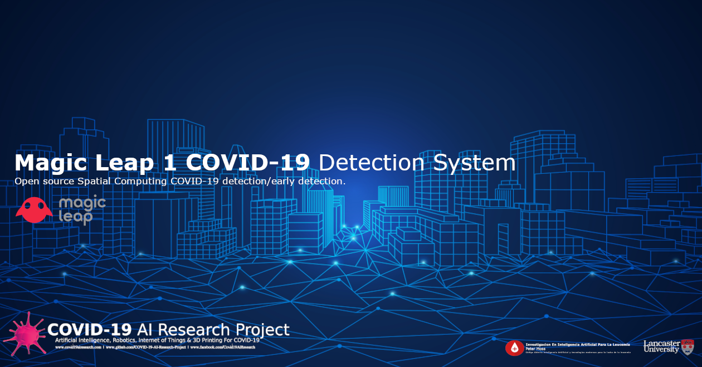
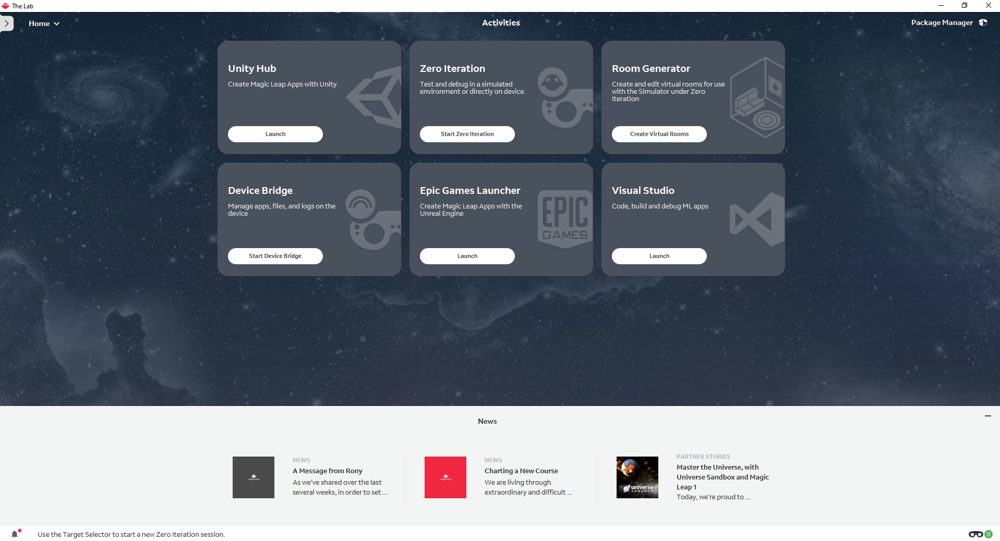
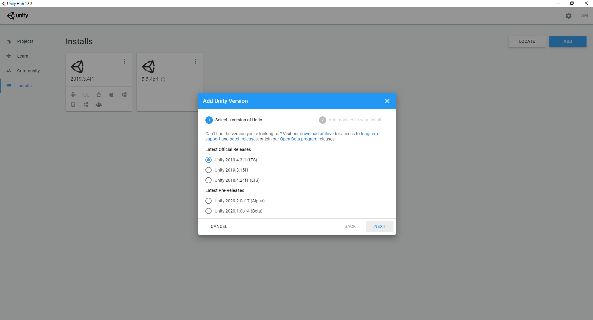
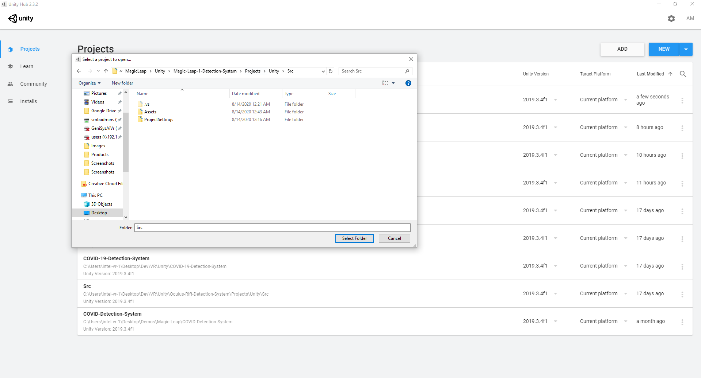
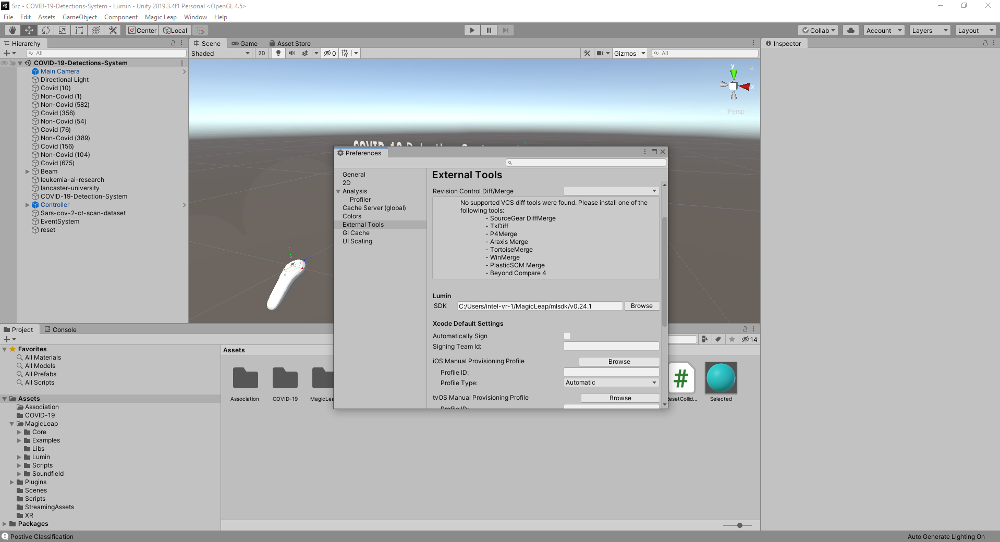

# Peter Moss COVID-19 AI Research Project
## Magic Leap 1 COVID-19 Detection System
### Unity

[](https://github.com/COVID-19-AI-Research-Project/Magic-Leap-1-Detection-System)

&nbsp;

# Table Of Contents

- [Introduction](#introduction)
- [Required Hardware](#required-hardware)
- [Prerequisites](#prerequisites)
  - [HIAS Server](#hias-server)
  - [COVID-19 Tensorflow DenseNet Classifier](#covid-19-tensorflow-densenet-classifier)
  - [COVID-19 Tensorflow DenseNet Classifier For Raspberry Pi 4](#covid-19-tensorflow-densenet-classifier))
  - [Clone the repository](#clone-the-repository)
    - [Developer Forks](#developer-forks)
- [Installation](#installation)
    - [Magic Leap Basics](#magic-leap-basics)
    - [Unity 2019.3.4f1](#unity-201934f1)
    - [Magic Leap 1](#magic-leap-1)
- [Continue](#continue)
- [Contributing](#contributing)
  - [Contributors](#contributors)
- [Versioning](#versioning)
- [License](#license)
- [Bugs/Issues](#bugs-issues)

&nbsp;

# Introduction

The following guide will take you through setting up and installing the [ Magic Leap 1 COVID-19 Detection System](https://github.com/COVID-19-AI-Research-Project/Magic-Leap-1-Detection-System/Projects/Unity " Magic Leap 1 COVID-19 Detection System").

We would like to thank Rodney at Magical Light and Sound for personally taking his time to help us get off the ground with using the Unity development platform with Magic Leap. You can follow his tutorials on his [Github](https://github.com/magicallightandsound "Github") and [Twitch](https://www.twitch.tv/rodneydeveloper "Twitch"). 

&nbsp;

# Required Hardware

- [Magic Leap 1](https://www.magicleap.com/en-us/magic-leap-1 "Magic Leap 1")
- VR Ready Laptop / PC / Mac

&nbsp;

# Prerequisites

Before you can install the Magic Leap 1 Unity COVID-19 Detection System, there are some prerequisites. 

## HIAS Server

If you are going to be using the full system you will need to install the [HIAS](https://github.com/LeukemiaAiResearch/HIAS "HIAS") server. Follow the [HIAS Installation Guide](https://github.com/LeukemiaAiResearch/HIAS/blob/master/Documentation/Installation/Installation.md "HIAS Installation Guide") to complete your HIAS server setup. 

If you chose not to use the full system, steps are provided in this tutorial that will allow you to use the system without a HIAS installation.

## COVID-19 Tensorflow DenseNet Classifier

If you want to train your own Artificial Intelligence required to detect COVID-19, you will need to complete the [COVID-19 Tensorflow DenseNet Classifier](https://github.com/COVID-19-AI-Research-Project/AI-Classification/tree/master/Projects/2) tutorial. If you would like to use the pre-trained model we have provided, you can skip to the next step.

**YOU MUST USE THE SAME TRAIN AND TEST DATA AS THE TUTORIAL SPECIFIES**  
The test data provided in the Magic Leap 1 Unity COVID-19 Detection System requires the same model to be used. 

## COVID-19 Tensorflow DenseNet Classifier For Raspberry Pi 4

The COVID-19 Tensorflow DenseNet Classifier For Raspberry Pi 4 hosts a local server on a RPI4 allowing images to be classified remotely. In this project we use the AI model trained in the **COVID-19 Tensorflow DenseNet Classifier**, but we also provide the pre-trained model so that you can use the classifier "out of the box". 

Regardless of whether you choose to train your own model or use the pre-trained model, you will need to complete the [COVID-19 Tensorflow DenseNet Classifier For Raspberry Pi 4](https://github.com/COVID-19-AI-Research-Project/AI-Classification/tree/master/Projects/3) tutorial as this is the project that creates the classifier that the Magic Leap 1 will interact with. 

## Clone the repository

Clone the [COVID-19 AI Classification](https://github.com/COVID-19-AI-Research-Project/AI-Classification " COVID-19 AI Classification") repository from the [Peter Moss COVID-19 AI Research](https://github.com/COVID-19-AI-Research-Project "Peter Moss COVID-19 AI Research") Github Organization.

To clone the repository and install the COVID-19 Tensorflow DenseNet Classifier For Raspberry Pi 4, make sure you have Git installed. Now navigate to the home directory on your device using terminal/commandline, and then use the following command.

```
$ git clone https://github.com/COVID-19-AI-Research-Project/Magic-Leap-1-Detection-System.git
```

Once you have used the command above you will see a directory called **COVID-19-AI-Research-Project** in your home directory.

```
ls
```

Using the ls command in your home directory should show you the following.

```
Magic-Leap-1-Detection-System
```

Navigate to **Magic-Leap-1-Detection-System/Projects/Unity** directory, this is your project root directory for this tutorial.

### Developer Forks

Developers from the Github community that would like to contribute to the development of this project should first create a fork, and clone that repository. For detailed information please view the [CONTRIBUTING](../../../CONTRIBUTING.md "CONTRIBUTING") guide. You should pull the latest code from the development branch.

```
  $ git clone -b "0.2.0" https://github.com/COVID-19-AI-Research-Project/Magic-Leap-1-Detection-System.git
```

The **-b "0.2.0"** parameter ensures you get the code from the latest master branch. Before using the below command please check our latest master branch in the button at the top of the project README.

&nbsp;

# Installation

Below you will find the steps required to setup for Magic Leap development.

## Magic Leap Basics

Follow the [Magic Leap Developer Setup](https://developer.magicleap.com/en-us/learn/guides/develop-setup "Magic Leap Developer Setup") guide to install the required Magic Leap development tools.

## Unity 2019.3.4f1

For Magic Leap apps you need Unity 2019.3.4f1. Head to the [Unity 2019.3.4](https://unity3d.com/unity/whats-new/2019.3.4 "Unity 2019.3.4") page and download and install the **Lumin Target Support** exe. 

Open **Magic Leap's Lab** and click on the **Launch** button for **Unity Hub**.

[](https://developer.magicleap.com/en-us/learn/guides/lab)

Unity Hub will now open. 



Go to the **Installs** tab in Unity Hub and select **Unity 2019.3.4f1 (LTS)**, click next and continue until Unity 2019.3.4f1 (LTS) is installed.



Click on the **ADD** button. This will open Windows Explorer allowing you to navigate to the project and import it. 

To import Magic Leap 1 Unity COVID-19 Detection System into Unity Hub, navigate to the **Magic-Leap-1-Detection-System/Src** directory and click **Select Folder**.

Now for some configuration. In Unity, open **File->Build Settings** and change the target to **Lumin** if not already done.



Now go to **Edit->Preferences** and head to the **Lumin** section. You now need to use the browse button to navigate to your version of the Lumin SDK. It should be in the path **C:/Users/YourUser/MagicLeap/mlsdk/v0.24.1**.

Next you need to add your Magic Leap certificate. Follow the [Get a Developer Certificate](https://developer.magicleap.com/en-us/learn/guides/developer-certificates "Get a Developer Certificate") guide on Magic Leap's website. 

Once you have your certificate you need to add it to your Unity project. Go to **Edit->Project Settings->Publish Settings** and click **Sign Package** then click the button **...** to open Explorer, navigate to the location you saved your certificate to and select the folder. 

# Magic Leap 1

You now need to setup your device for development. Power up your Magic Leap 1 and head to  **Settings->Device->Developer Mode**. You need to **Enable Developer Mode**, **Allow Untrusted Sources**, and **Enable MLDB Access**.

# Continue

You are now ready to continue with the [Unity](../../../Projects/Unity/ "Unity") tutorial to take the final steps in getting your application running.

&nbsp;

# Contributing

The Peter Moss COVID-19 AI Research Project encourages and welcomes code contributions, bug fixes and enhancements from the Github.

Please read the [CONTRIBUTING](../../../CONTRIBUTING.md "CONTRIBUTING") document for a full guide to forking our repositories and submitting your pull requests. You will also find information about our code of conduct on this page.

## Contributors

- [Adam Milton-Barker](https://www.leukemiaresearchassociation.ai/team/adam-milton-barker "Adam Milton-Barker") - [Asociacion De Investigation En Inteligencia Artificial Para La Leucemia Peter Moss](https://www.leukemiaresearchassociation.ai "Asociacion De Investigation En Inteligencia Artificial Para La Leucemia Peter Moss") President & Lead Developer, Sabadell, Spain

&nbsp;

# Versioning

We use SemVer for versioning. For the versions available, see [Releases](../../../releases "Releases").

&nbsp;

# License

This project is licensed under the **MIT License** - see the [LICENSE](../../../LICENSE "LICENSE") file for details.

&nbsp;

# Bugs/Issues

We use the [repo issues](../../../issues "repo issues") to track bugs and general requests related to using this project. See [CONTRIBUTING](../../../CONTRIBUTING.md "CONTRIBUTING") for more info on how to submit bugs, feature requests and proposals.


