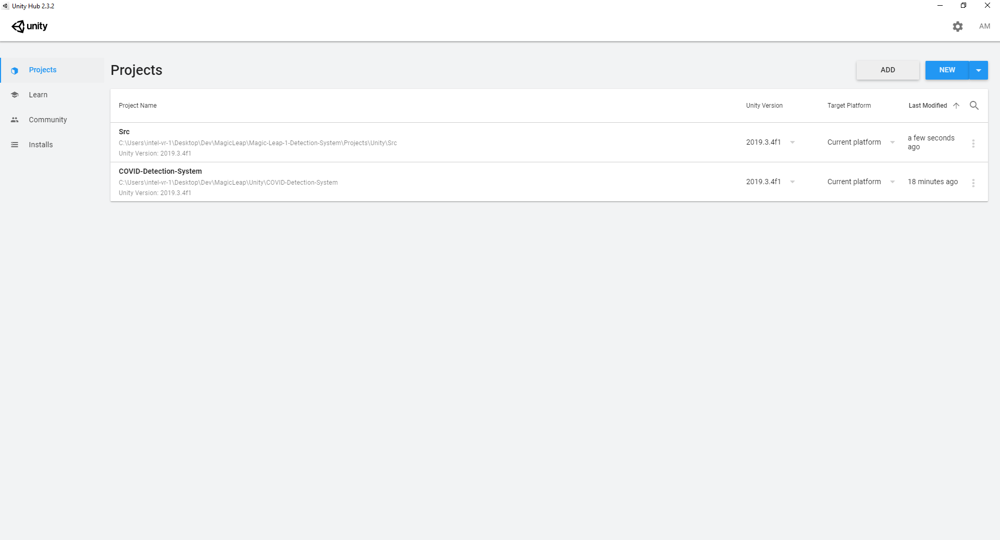
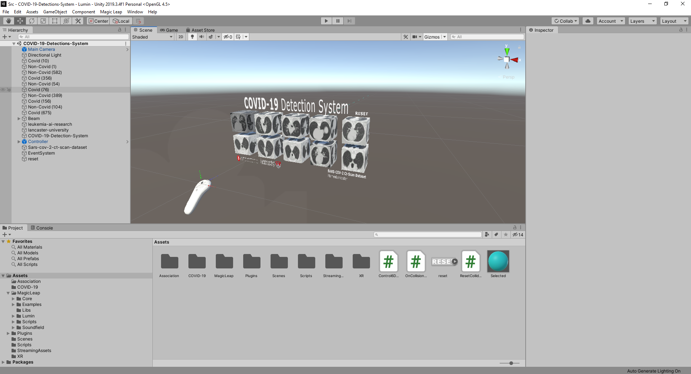
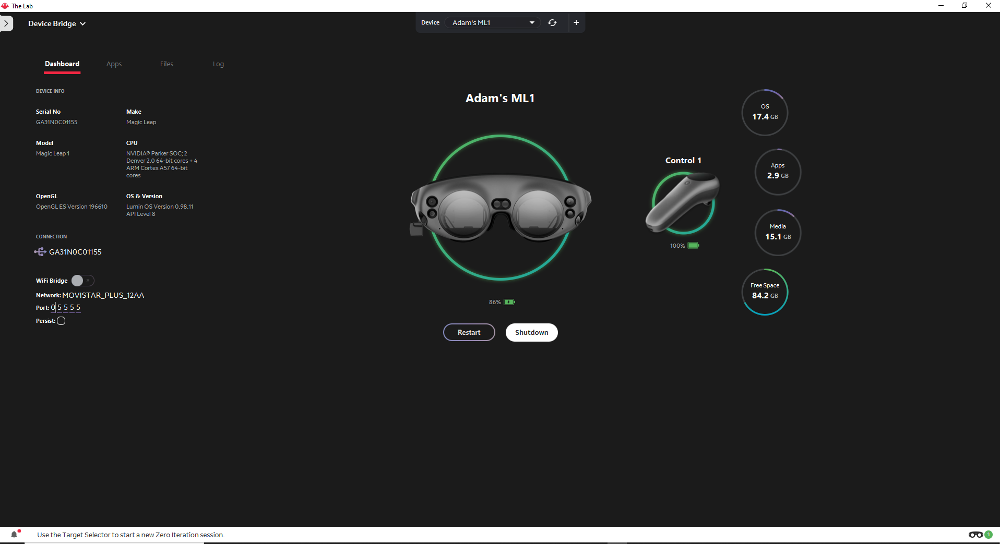
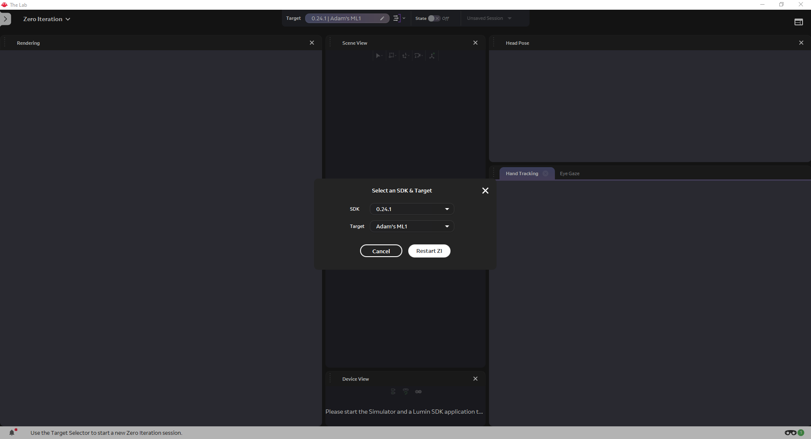
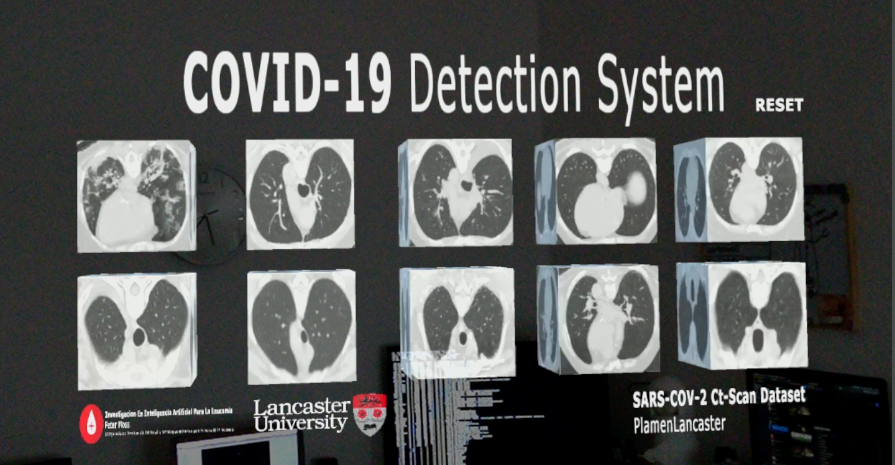
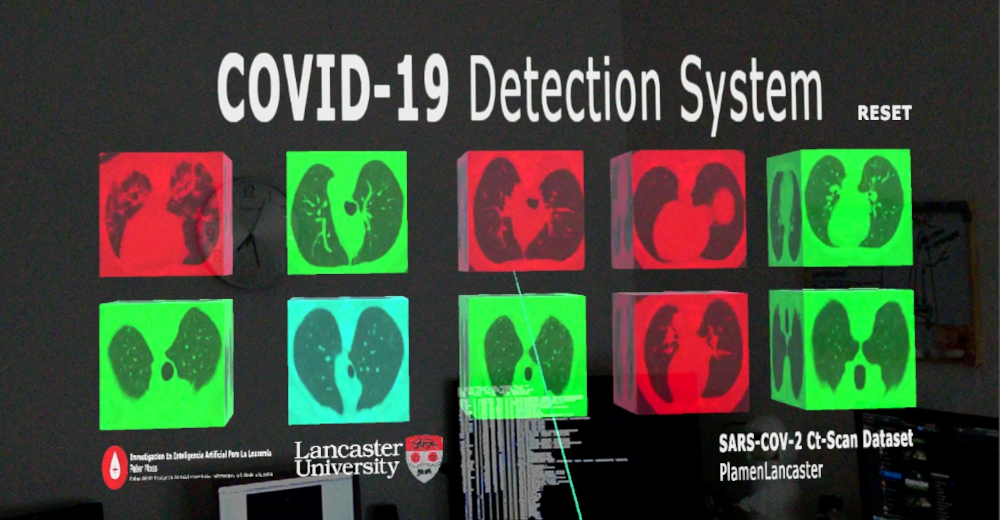

# Peter Moss COVID-19 AI Research Project
## Magic Leap 1 Unity COVID-19 Detection System

&nbsp;

# Table Of Contents

- [Introduction](#introduction)
- [DISCLAIMER](#disclaimer)
- [Prerequisites](#prerequisites)
  - [HIAS Server](#hias-server)
  - [COVID-19 Tensorflow DenseNet Classifier](#covid-19-tensorflow-densenet-classifier)
  - [COVID-19 Tensorflow DenseNet Classifier For Raspberry Pi 4](#covid-19-tensorflow-densenet-classifier)
- [Installation](#installation)
- [Useage](#useage)
  - [Unity Hub](#unity-hub)
  - [Device Bridge](#device-bridge)
  - [Zero Iteration](#zero-iteration)
  - [Classification Server](#classification-server)
  - [Run The App](#run-the-app)
- [Contributing](#contributing)
  - [Contributors](#contributors)
- [Versioning](#versioning)
- [License](#license)
- [Bugs/Issues](#bugs-issues)

&nbsp;

# Introduction

The Magic Leap 1 COVID-19 Detection System 2020 uses Tensorflow 2, Raspberry Pi 4 & Magic Leap 1 to provide a spatial computing detection system. 

The project uses the [COVID-19 Tensorflow DenseNet Classifier](https://github.com/COVID-19-AI-Research-Project/AI-Classification/blob/master/Projects/2 "COVID-19 Tensorflow DenseNet Classifier") a Tensorflow implementation of DenseNet and the [SARS-COV-2 Ct-Scan Dataset](https://www.kaggle.com/plameneduardo/sarscov2-ctscan-dataset "SARS-COV-2 Ct-Scan Dataset"), a large dataset of CT scans for SARS-CoV-2 (COVID-19) identification created by our partners at [Lancaster University](https://www.lancaster.ac.uk/), Plamenlancaster: [Professor Plamen Angelov](https://www.lancaster.ac.uk/lira/people/#d.en.397371) Centre Director @ [Lira](https://www.lancaster.ac.uk/lira/), & his researcher, [Eduardo Soares PhD](https://www.lancaster.ac.uk/sci-tech/about-us/people/eduardo-almeida-soares).

We use the trained model from **COVID-19 Tensorflow DenseNet Classifier** with the [COVID-19 Tensorflow DenseNet Classifier For Raspberry Pi 4](https://github.com/COVID-19-AI-Research-Project/AI-Classification/blob/master/Projects/3 "COVID-19 Tensorflow DenseNet Classifier For Raspberry Pi 4") and serve an API endpoint that exposes the Artificial Intelligence classifier allowing **Magic Leap 1** to communicate with it.

&nbsp;

# DISCLAIMER

This project should be used for research purposes only. The purpose of the project is to show the potential of Spatial Computing, Artificial Intelligence, and the Internet of Things for medical support systems such as diagnosis systems. 

Although the classifier used in this project is very accurate and shows good results both on paper and in real world testing, it is not meant to be an alternative to professional medical diagnosis.

Developers that have contributed to this repository have experience in using Artificial Intelligence for detecting certain types of cancer & COVID-19. They are not a doctors, medical or cancer/COVID-19 experts. Please use these systems responsibly.

&nbsp;

# Prerequisites

Before you can install the Magic Leap 1 Unity COVID-19 Detection System, there are some prerequisites. 

## HIAS Server

If you are going to be using the full system you will need to install the [HIAS](https://github.com/LeukemiaAiResearch/HIAS "HIAS") server. Follow the [HIAS Installation Guide](https://github.com/LeukemiaAiResearch/HIAS/blob/master/Documentation/Installation/Installation.md "HIAS Installation Guide") to complete your HIAS server setup. 

If you chose not to use the full system, steps are provided in this tutorial that will allow you to use the system without a HIAS installation.

## COVID-19 Tensorflow DenseNet Classifier

If you want to train your own Artificial Intelligence required to detect COVID-19, you will need to complete the [COVID-19 Tensorflow DenseNet Classifier](https://github.com/COVID-19-AI-Research-Project/AI-Classification/tree/master/Projects/2) tutorial. If you would like to use the pre-trained model we have provided, you can skip to the next step.

**YOU MUST USE THE SAME TRAIN AND TEST DATA AS THE TUTORIAL SPECIFIES**  
The test data provided in the Magic Leap 1 Unity COVID-19 Detection System requires the same model to be used. 

## COVID-19 Tensorflow DenseNet Classifier For Raspberry Pi 4

The COVID-19 Tensorflow DenseNet Classifier For Raspberry Pi 4 hosts a local server on a RPI4 allowing images to be classified remotely. In this project we use the AI model trained in the **COVID-19 Tensorflow DenseNet Classifier**, but we also provide the pre-trained model so that you can use the classifier "out of the box". 

Regardless of whether you choose to train your own model or use the pre-trained model, you will need to complete the [COVID-19 Tensorflow DenseNet Classifier For Raspberry Pi 4](https://github.com/COVID-19-AI-Research-Project/AI-Classification/tree/master/Projects/3) tutorial as this is the project that creates the classifier that the Magic Leap 1 will interact with. 

&nbsp;

# Installation

Please follow the [Installation Guide](Documentation/Installation.md) to install Magic Leap 1 Unity COVID-19 Detection System.

&nbsp;

# Useage

After following the installation guide you should now have all of the required tools installed. Use the following guides to start using the **Magic Leap 1 Unity COVID-19 Detection System**.

## Unity Hub

Open **Magic Leap's Lab** and click on the **Launch** button for **Unity Hub**.

Click on the **ADD** button. This will open Windows Explorer allowing you to navigate to the project and import it. 

To import Magic Leap 1 Unity COVID-19 Detection System into Unity Hub, navigate to the **Magic-Leap-1-Detection-System/Src** directory and click **Select Folder**.

Once you have done this you can open the project in Unity by clicking on it. 

## Device Bridge

Now you need to setup your Magic Leap 1 device in [Device Bridge](https://developer.magicleap.com/en-us/learn/guides/magic-leap-device-bridge-reference "Device Bridge"). To do this first turn on your Magic Leap device and open your world. Make sure you are in the center of your room and facing the way you want your app to open.

Once turned on and inside your world, you need to attach your Magic Leap 1 to your computer using the USB type C  connector. 

Now head to Device Bridge in Lab. You should see the above in Device Bridge.

Click on the **WiFi Bridge** button to activate WiFi, Device Bridge will reload and you should see the IP assigned to your device. This means that your PC is now bridged to the Magic Leap 1 device via WiFi.

## Zero Iteration

[Zero Iteration](https://developer.magicleap.com/en-us/learn/guides/lab-zi "Zero Iteration") allows you to run your apps directly on the Magic Leap 1 device. Providing you have followed the above steps, open Zero Iterator from the Lab homepage, select your device, and restart the program. 

## Classification Server

Now you need to make sure that your **COVID-19 Tensorflow DenseNet Classifier For Raspberry Pi 4** is running in **Server** mode and waiting for requests.

## Run The App

Now you are ready to fire up the Magic Leap 1 Unity COVID-19 Detection System! 

Head over to Unity and click on the play button. You can remove the cable connection and move to the center of your room. You should now see the Magic Leap 1 Unity COVID-19 Detection System in yor view. 

Now use your controller to hit the blocks by pointing the laser at the blocks. This will send the relevant image to the server for classification. 

The server will return the response to the Magic Leap 1 and the color of the block will change. 

- **RED** Specifies a true positive (COVID-19 positive)
- **GREEN** Specifies a true negative (COVID-19 negative)
- **Magento** Specifies a false positive (COVID-19 negative but classifier determined COVID-19 positive)
- **Cyan** Specifies a false negative (COVID-19 positive but classifier determined COVID-19 negative)

You can reset the application by hitting the **RESET** button with the laser.

&nbsp;

# Contributing

The Peter Moss COVID-19 AI Research Project encourages and welcomes code contributions, bug fixes and enhancements from the Github.

Please read the [CONTRIBUTING](../../CONTRIBUTING.md "CONTRIBUTING") document for a full guide to forking our repositories and submitting your pull requests. You will also find information about our code of conduct on this page.

## Contributors

- [Adam Milton-Barker](https://www.leukemiaresearchassociation.ai/team/adam-milton-barker "Adam Milton-Barker") - [Asociacion De Investigation En Inteligencia Artificial Para La Leucemia Peter Moss](https://www.leukemiaresearchassociation.ai "Asociacion De Investigation En Inteligencia Artificial Para La Leucemia Peter Moss") President & Lead Developer, Sabadell, Spain

&nbsp;

# Versioning

We use SemVer for versioning. For the versions available, see [Releases](../../releases "Releases").

&nbsp;

# License

This project is licensed under the **MIT License** - see the [LICENSE](../../LICENSE "LICENSE") file for details.

&nbsp;

# Bugs/Issues

We use the [repo issues](issues "repo issues") to track bugs and general requests related to using this project. See [CONTRIBUTING](../../CONTRIBUTING.md "CONTRIBUTING") for more info on how to submit bugs, feature requests and proposals.