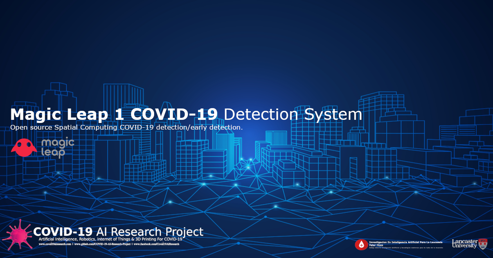

# Peter Moss COVID-19 AI Research Project
## Magic Leap 1 COVID-19 Detection System

 

&nbsp;

# Table Of Contents

- [Introduction](#introduction)
- [DISCLAIMER](#disclaimer)
- [Magic Leap 1](#magic-leap-1)
- [Unity](#unity-3d)
- [Contributing](#contributing)
  - [Contributors](#contributors)
- [Versioning](#versioning)
- [License](#license)
- [Bugs/Issues](#bugs-issues)

&nbsp;

# Introduction

The Magic Leap 1 COVID-19 Detection System 2020 uses Tensorflow 2, Raspberry Pi 4 & Magic Leap 1 to provide a spatial computing detection system.

The project uses the [COVID-19 Tensorflow DenseNet Classifier](https://github.com/COVID-19-AI-Research-Project/AI-Classification/blob/master/Projects/2 "COVID-19 Tensorflow DenseNet Classifier") a Tensorflow implementation of DenseNet and the [SARS-COV-2 Ct-Scan Dataset](https://www.kaggle.com/plameneduardo/sarscov2-ctscan-dataset "SARS-COV-2 Ct-Scan Dataset"), a large dataset of CT scans for SARS-CoV-2 (COVID-19) identification created by our partners at [Lancaster University](https://www.lancaster.ac.uk/), Plamenlancaster: [Professor Plamen Angelov](https://www.lancaster.ac.uk/lira/people/#d.en.397371) Centre Director @ [Lira](https://www.lancaster.ac.uk/lira/), & his researcher, [Eduardo Soares PhD](https://www.lancaster.ac.uk/sci-tech/about-us/people/eduardo-almeida-soares).

We use the trained model from **COVID-19 Tensorflow DenseNet Classifier** with the [COVID-19 Tensorflow DenseNet Classifier For Raspberry Pi 4](https://github.com/COVID-19-AI-Research-Project/AI-Classification/blob/master/Projects/3 "COVID-19 Tensorflow DenseNet Classifier For Raspberry Pi 4") and serve an API endpoint that exposes the Artificial Intelligence classifier allowing **Magic Leap 1** to communicate with it.

&nbsp;

# DISCLAIMER

These projects should be used for research purposes only. The purpose of the projects are to show the potential of Spatial Computing, Artificial Intelligence, and the Internet of Things for medical support systems such as diagnosis systems. Although the classifier used in this project is very accurate and shows good results both on paper and in real world testing, it is not meant to be an alternative to professional medical diagnosis. Developers that have contributed to this repository have experience in using Artificial Intelligence for detecting certain types of cancer & COVID-19. They are not a doctors, medical or cancer/COVID-19 experts. Please use these systems responsibly.

&nbsp;

# Magic Leap 1

&nbsp;

# Unity 3D

&nbsp;

# Contributing

The Peter Moss COVID-19 AI Research Project encourages and welcomes code contributions, bug fixes and enhancements from the Github.

Please read the [CONTRIBUTING](CONTRIBUTING.md "CONTRIBUTING") document for a full guide to forking our repositories and submitting your pull requests. You will also find information about our code of conduct on this page.

## Contributors

- [Adam Milton-Barker](https://www.leukemiaresearchassociation.ai/team/adam-milton-barker "Adam Milton-Barker") - [Asociacion De Investigation En Inteligencia Artificial Para La Leucemia Peter Moss](https://www.leukemiaresearchassociation.ai "Asociacion De Investigation En Inteligencia Artificial Para La Leucemia Peter Moss") President & Lead Developer, Sabadell, Spain

&nbsp;

# Versioning

We use SemVer for versioning. For the versions available, see [Releases](releases "Releases").

&nbsp;

# License

This project is licensed under the **MIT License** - see the [LICENSE](LICENSE "LICENSE") file for details.

&nbsp;

# Bugs/Issues

We use the [repo issues](issues "repo issues") to track bugs and general requests related to using this project. See [CONTRIBUTING](CONTRIBUTING.md "CONTRIBUTING") for more info on how to submit bugs, feature requests and proposals.

